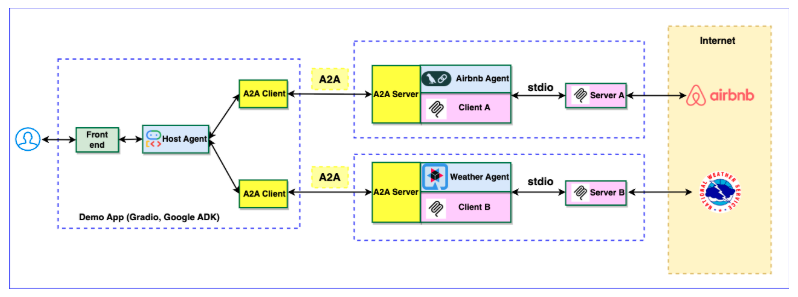
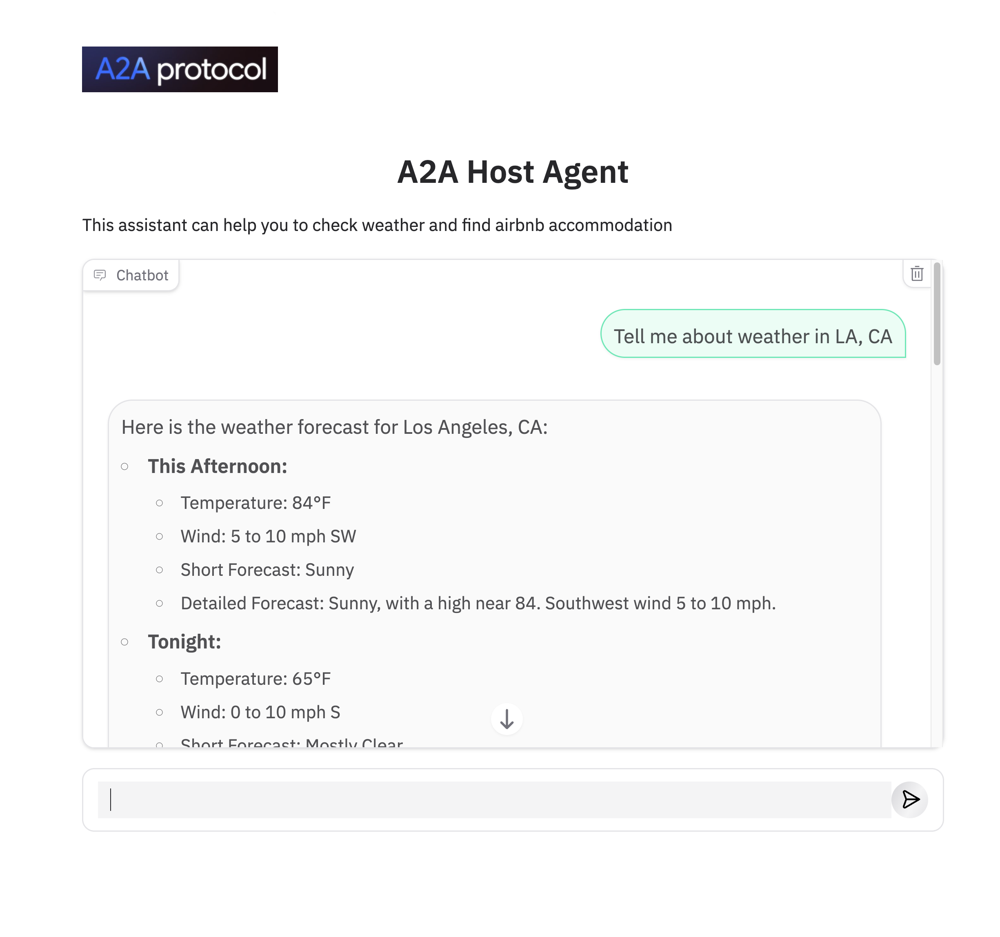

# Using A2A for multi-agent orchestration with Python and Java agents
----
> *⚠️ DISCLAIMER: THIS DEMO IS INTENDED FOR DEMONSTRATION PURPOSES ONLY. IT IS NOT INTENDED FOR USE IN A PRODUCTION ENVIRONMENT.*  

> *⚠️ Important: A2A is a work in progress (WIP) thus, in the near future there might be changes that are different from what demonstrated here.*
----

This sample is based off the Python [airbnb_planner_multiagent](../../python/agents/airbnb_planner_multiagent) sample and highlights how to use Google's Agent to Agent (A2A) protocol for multi-agent orchestration where at least one of the agents is a Java agent. 

This sample makes use of our new [Java SDK for A2A](https://github.com/fjuma/a2a-java-sdk). The application features a host agent coordinating tasks between a Python remote agent and a Java remote agent that interact with various MCP servers to fulfill user requests.

## Architecture

The application utilizes a multi-agent architecture where a host agent delegates tasks to remote agents (Airbnb and Weather) based on the user's query. These agents then interact with corresponding MCP servers.

The Weather agent is implemented in **Java** while the Airbnb agent is implemented in **Python**.



### Java Agent

The Weather app is a Quarkus application that depends on our A2A Java SDK to communicate with a Python A2A client
using the A2A protocol. It provides weather information based on user queries by leveraging a Python MCP server
that retrieves weather data from https://api.weather.gov.

Let's take a closer look at the classes that make up the Weather app:

- **[WeatherAgent](weather_agent/src/main/java/com/samples/a2a/WeatherAgent.java)**: This is a Quarkus LangChain4j [AiService](https://docs.quarkiverse.io/quarkus-langchain4j/dev/ai-services.html). It connects to a weather MCP server and exposes an AI method to handle weather-related requests.


- **[WeatherAgentCardProducer](weather_agent/src/main/java/com/samples/a2a/WeatherAgentCardProducer.java)**: This class has a method that creates the A2A `AgentCard` that describes what our Weather Agent can do. This allows other agents or clients to find out about our Weather Agent's capabilities.


- **[WeatherAgentExecutorProducer](weather_agent/src/main/java/com/samples/a2a/WeatherAgentExecutorProducer.java)**: This class has a method that creates the A2A `AgentExecutor` that will be used to send queries to the Weather Agent and to send responses and updates back to the A2A client. The agent executor is meant to be a bridge between the A2A protocol and the agent's logic.


#### A2A Java SDK
The `AgentCard` and `AgentExecutor` classes mentioned above are part of our [A2A Java SDK](https://github.com/fjuma/a2a-java-sdk). Notice that our Weather app's [`pom.xml`](weather_agent/pom.xml) has a dependency on the `a2a-java-sdk-core` and `a2a-java-sdk-quarkus` libraries. Simply adding these dependencies to your Java application and providing `AgentCard` and `AgentExecutor` producers  makes it possible to easily run agentic Java applications as A2A servers using the A2A protocol. Note that we used the `a2a-java-sdk-quarkus` library in this example since our app is a Quarkus application. You can also use the `a2a-java-sdk` library instead which is based off Jakarta REST.

The A2A Java SDK can also be used to create A2A clients that can communicate with A2A servers.

### Python Agent

The Airbnb app is a Python application that uses the A2A Python SDK to communicate with a Python A2A client. It interacts with an Airbnb MCP server to find accommodations based on user queries.

## App UI



## Setup and Deployment

### Prerequisites

Before running the application locally, ensure you have the following installed:

1. **Node.js:** Required to run the Airbnb MCP server (if testing its functionality locally).
2. **uv:** The Python package management tool used in this project. Follow the installation guide: [https://docs.astral.sh/uv/getting-started/installation/](https://docs.astral.sh/uv/getting-started/installation/)
3. **python 3.13** Python 3.13 is required to run a2a-sdk 
4. **Set up .env** 


- Create a .env file in the `airbnb_agent` directory as follows:
```bash
cd airbnb_agent
cp .env.example .env
```

Then update the `.env` file to specify your Google AI Studio API Key:

```bash
GOOGLE_API_KEY="your_api_key_here" 
```

- Create a .env file in the `weather_agent` directory as follows:

```bash
cd ../weather_agent
cp .env.example .env
```

Then update the `.env` file to specify your Google AI Studio API Key (note that no quotes are needed below):

```bash
QUARKUS_LANGCHAIN4J_AI_GEMINI_API_KEY=your_api_key_here
```

- Create a .env file in the `host_agent` directory as follows:

```bash
cd ../host_agent
cp .env.example .env
```

Then update the `.env` file to specify your Google AI Studio API Key:

```bash
GOOGLE_API_KEY="your_api_key_here" 
AIR_AGENT_URL=http://localhost:10002
WEA_AGENT_URL=http://localhost:10001
```

## 1. Run Airbnb Agent

Run the airbnb agent server:

```bash
cd airbnb_agent
uv run .
```

## 2. Build our A2A Java SDK

> *⚠️ This is a temporary step until our A2A Java SDK is released*

```bash
git clone https://github.com/fjuma/a2a-java-sdk.git
cd a2a-java-sdk
mvn clean install
```

## 3. Run Weather Agent

Open a new terminal and run the weather agent:

```bash
cd samples/python/agents/airbnb_planner_multiagent/weather_agent
mvn quarkus:dev
```

Note that Quarkus will automatically start up the weather Python MCP server that's needed by the Weather Agent since we've added the `quarkus.langchain4j.mcp.weather.transport-type` and the `quarkus.langchain4j.mcp.weather.command` properties in the [application.properties](weather_agent/src/main/resources/application.properties) file.

## 4. Run Host Agent
Open a new terminal and run the host agent server:

```bash
cd samples/python/agents/airbnb_planner_multiagent/host_agent
uv run app.py
```

## 5. Test at the UI

Here are example questions:

- "Tell me about weather in LA, CA"  

- "Please find a room in LA, CA, June 20-25, 2025, two adults"

## References
- https://github.com/google-a2a/a2a-samples/blob/main/samples/python/agents/airbnb_planner_multiagent
- https://github.com/google/a2a-python
- https://codelabs.developers.google.com/intro-a2a-purchasing-concierge#1
- https://google.github.io/adk-docs/
